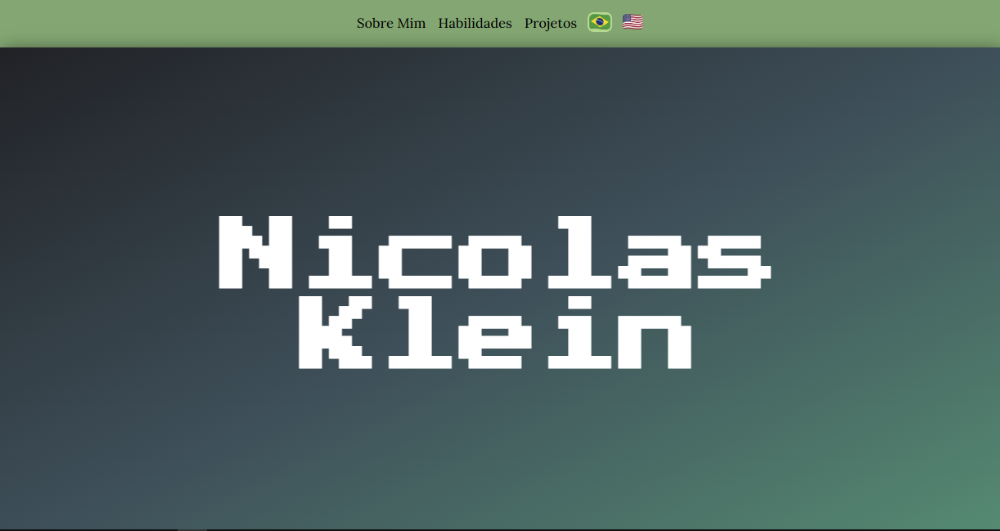
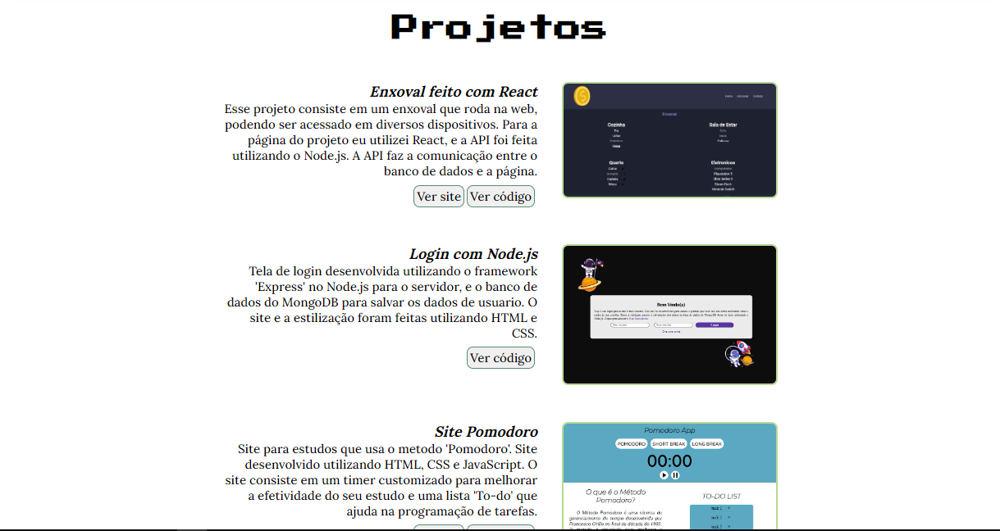

# Portfolio made with React
  
 
 .
 ### Demo App: https://nk-portfolio-react.netlify.app
# About
 This project is basically my own portfolio that I made using React.
 The "projects" part use flex rendering.
 I just need to update a JSON file to update this part of the project.
 
 .
# Used Tecnologies
 ### Front-end
 - React
 - JavaScript
 - JSX
 - CSS

 ### Implantation
 - Website: https://nk-portfolio-react.netlify.app

# Author
 Nicolas Klein Faria de Araujo  
 https://nicolaskleinaraujo.github.io/portfolio/
 
